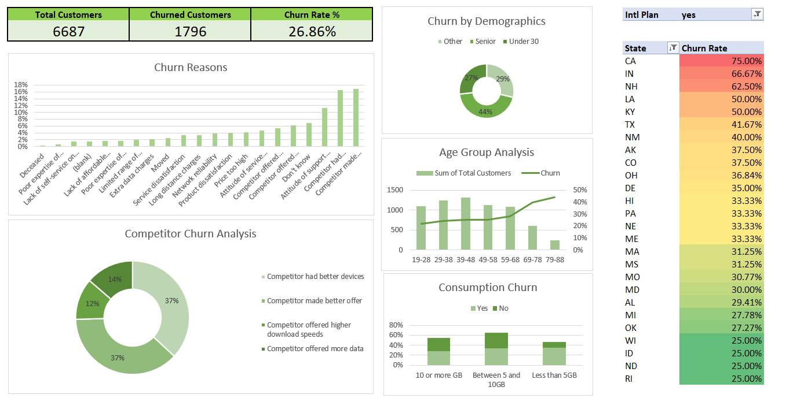

# customer-churn-analysis-excel
Customer churn analysis dashboard built using Excel with pivot tables and data analysis.

## Project Overview
This project analyzes customer churn in a telecom dataset containing **6,687 customers**.
The objective was to identify patterns and factors that contribute to customer churn and present the insights using an Excel dashboard.

## Tools Used
- Microsoft Excel
- Pivot Tables
- Data Cleaning
- Excel Dashboard Design

## Key Metrics
- Total Customers: 6,687
- Churned Customers: 1,796
- Churn Rate: 26.86%

## Dashboard Features
The dashboard provides visual insights through:
- Churn reasons analysis
- Age group churn patterns
- Competitor-related churn breakdown
- Data consumption vs churn behavior
- State-wise churn rate analysis

## Key Insights
- Competitor pricing is one of the major drivers of customer churn.
- Customers with month-to-month contracts churn more frequently.
- Higher customer service calls correlate with higher churn risk.
- Certain states show higher churn rates than others.

## Project Files
- Customer_Churn_Analysis.xlsx → Excel file containing dataset, analysis, and dashboard
- Overview.png → Screenshot of the final dashboard
